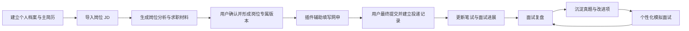
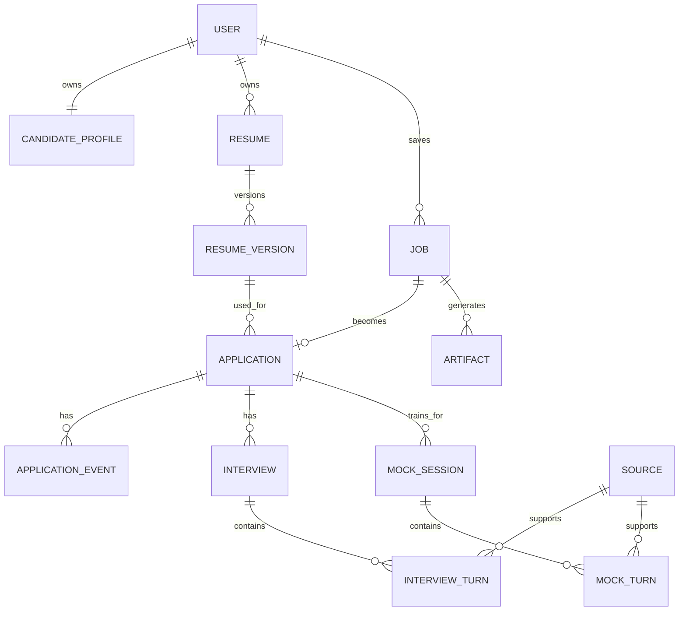

# 招聘求职集合 Agent — MVP PRD V0.1

## 0. 文档信息

- 状态：已确认基线
- 版本：V0.1
- 日期：2026-07-17
- 产品形态：Web 求职工作台 + Chrome 浏览器插件 + AI Agent 服务
- 首批范围：个人使用验证，随后扩大到 20 人以内内测
- 核心原则：AI 负责理解、生成、整理和建议；用户负责确认、修改和最终提交

## 1. 产品定义

### 1.1 一句话描述

一个覆盖“岗位分析—简历定制—辅助投递—进度管理—面试复盘—模拟训练”的个人求职工作台。

### 1.2 目标用户

首版聚焦：

- 校招及毕业 0–3 年的求职者
- 同时申请多个岗位、需要维护多个简历版本的人
- 运营、产品、法务等以文字材料和结构化面试为主的岗位
- 当前依赖表格、文档或记忆管理投递进度的人

### 1.3 用户核心问题

1. 同一份简历海投，无法针对不同 JD 突出匹配经历。
2. 重复填写网申表单耗时，且容易漏填或错填。
3. 投递渠道和后续进展分散，难以统计和复盘。
4. 面试结束后缺少结构化记录，类似问题反复答不好。
5. 面试经验和真题来源零散，难以转化为个性化训练。

### 1.4 产品价值

- 每个岗位形成一份完整的“求职档案”。
- 每次生成内容都基于用户真实经历，保留来源和修改记录。
- 自动化减少重复劳动，但不代替用户做不可逆的最终操作。
- 将投递和面试数据沉淀为后续求职策略的依据。

## 2. MVP 目标与非目标

### 2.1 MVP 目标

MVP 必须验证三个假设：

1. 用户愿意为每个岗位建立记录，并持续更新状态。
2. 基于 JD 的简历建议和 Cover Letter 能明显减少准备时间。
3. 插件填表、投递记录和面试复盘连成闭环后，比单点 AI 工具更有价值。

### 2.2 MVP 范围

#### P0：首版必须有

- 结构化个人档案和主简历
- 粘贴 JD 或由插件读取当前岗位页面
- JD 结构化分析和岗位分类
- 简历匹配分析、修改建议和岗位专属简历版本
- Cover Letter、求职邮件正文生成
- 岗位记录、投递记录、状态时间线和基础仪表盘
- 插件预览后填表，并展示成功、失败、需手动处理的字段
- 文本面试记录复盘
- 数据导出和账号内数据删除

#### P1：内测期间加入

- 基于 JD、简历、历史面试题的基础模拟面试
- 用户粘贴经验帖链接或文本，建立带出处的真题库
- 音频、视频或字幕文件上传与转写
- 支持更多 ATS 网站适配

#### 本轮明确不做

- 自动点击“提交申请”
- 无人值守批量海投
- 自动发送求职邮件
- 绕过登录、验证码或网站风控
- 从任意视频链接强制下载内容
- 后台批量抓取小红书笔记
- 未经用户确认直接覆盖主简历
- 承诺支持所有招聘网站

## 3. 核心用户流程

### 3.1 总流程

### 3.2 首次使用

1. 用户创建账号或进入本地模式。
2. 导入现有简历，或按模块填写教育、实习、项目、技能等信息。
3. 系统解析为结构化主档案。
4. 用户检查解析结果，确认哪些信息允许发送给 AI 服务。
5. 系统生成主简历 V1，并提示安装 Chrome 插件。

完成条件：用户拥有一份可编辑的结构化主档案和主简历版本。

### 3.3 JD 定制与投递

1. 用户粘贴 JD，或在岗位页面点击“保存岗位”。
2. 系统提取公司、岗位、地点、岗位类别、职责、硬性条件和关键词。
3. 系统展示：匹配项、弱匹配项、缺失项、建议强调的经历。
4. AI 生成逐条修改建议，标明修改前后差异及对应的真实经历来源。
5. 用户接受、修改或拒绝建议，形成岗位专属简历版本。
6. 系统生成 Cover Letter 和邮件正文。
7. 用户在招聘页面打开插件，预览即将填写的数据后执行填充。
8. 用户手动核对并最终提交。
9. 插件创建或更新投递记录；用户确认“已投递”。

完成条件：岗位、JD、定制简历、求职信和投递记录相互关联。

### 3.4 投递跟进

1. 用户从仪表盘查看各状态岗位。
2. 进入岗位详情，更新“笔试、面试、Offer、拒绝”等状态。
3. 每次变化自动写入时间线，可补充日期、联系人、备注和下一步事项。
4. 仪表盘按岗位类别、渠道、公司和状态统计。

### 3.5 面试复盘

1. 用户选择对应投递记录。
2. 粘贴面试文本；P1 支持上传音视频或字幕文件。
3. 系统拆分面试官问题与用户回答。
4. 用户修正说话人或文本识别错误。
5. AI 输出“题目—原回答—评价—优化回答—可能追问”。
6. 系统给出整体评价和后续训练清单。
7. 用户确认后，将题目写入个人真题库。

### 3.6 模拟面试

1. 用户选择目标岗位和面试类型。
2. 系统从 JD、主简历、岗位专属简历、历史真题和用户导入来源中组题。
3. 每道外部真题展示出处；AI 生成题标记为“AI 生成”。
4. Agent 逐题提问，并根据回答继续追问。
5. 结束后按表达结构、岗位匹配、事实证据、分析深度和风险点评分。
6. 结果写入训练记录，并更新个人改进项。

## 4. 功能需求与验收标准

| 模块 | 核心要求 | MVP 验收标准 |
|---|---|---|
| 个人档案 | 维护教育、实习、项目、技能、证书和求职偏好 | 可导入、编辑、导出；每条经历有唯一 ID |
| JD 分析 | 提取岗位信息、要求、关键词和岗位类别 | 用户可修改分析结果；保存原始 JD 与解析结果 |
| 简历定制 | 生成差异化建议和岗位专属版本 | 所有新增表述能追溯到已有经历；不得静默改写主简历 |
| 求职文案 | 生成 Cover Letter 和邮件正文 | 支持复制、编辑、重新生成并保存最终采用版本 |
| 浏览器填表 | 预览、用户触发填充、结果反馈 | 不自动提交；逐字段展示成功、失败、跳过和需确认 |
| 投递管理 | 看板、列表、分类、状态、时间线 | 每条投递关联岗位及简历版本；状态变化有时间记录 |
| 仪表盘 | 展示投递量、分类、状态和转化 | 可按时间和岗位类别筛选；数据与投递记录一致 |
| 面试复盘 | 结构化题目和回答，给出优化建议 | 用户可修改拆分结果；确认后才能进入真题库 |
| 真题来源 | 保存链接、平台、标题和摘录 | 外部题展示可访问的来源；AI 生成题不可伪装为真题 |
| 数据控制 | 导出、删除、敏感信息控制 | 用户可删除单条记录或全部数据；删除结果可验证 |

## 5. 信息架构

### 5.1 主要页面

1. 首页仪表盘：投递总量、状态分布、岗位分类、近期事项。
2. 岗位列表：搜索、筛选、批量分类。
3. 岗位工作区：JD、匹配分析、简历版本、求职文案、投递时间线、面试记录。
4. 个人档案：真实经历、技能、证书、求职偏好、敏感信息授权。
5. 简历中心：主简历、岗位专属版本、版本差异。
6. 面试中心：待复盘记录、历史复盘、真题库、模拟面试。
7. 设置与数据：模型设置、隐私授权、导入导出、数据删除。

### 5.2 插件侧边栏

- 当前岗位识别结果
- 保存岗位 / 更新 JD
- 选择岗位专属简历版本
- 填表前字段预览
- 执行填充
- 填充结果和人工处理清单
- 标记已投递

## 6. 数据模型 V0.1

### 6.1 实体关系

### 6.2 核心实体

| 实体 | 关键字段 | 说明 |
|---|---|---|
| User | id、email、mode、created_at | mode 区分本地模式和云同步模式 |
| CandidateProfile | user_id、basic_info、job_preferences、privacy_settings、updated_at | 结构化个人主档案；敏感字段单独存储 |
| ExperienceEntry | id、user_id、type、title、organization、start_at、end_at、facts、metrics、skills | type 包括教育、实习、项目、校园、证书等；是 AI 可引用的事实来源 |
| Resume | id、user_id、name、is_master | 简历逻辑容器 |
| ResumeVersion | id、resume_id、target_job_id、structured_content、rendered_file、evidence_refs、created_at | 每个岗位可有独立版本；evidence_refs 指向真实经历 |
| Job | id、user_id、company、title、category、location、url、channel、jd_raw、jd_parsed、created_at | 保存原始 JD 和结构化结果 |
| Application | id、user_id、job_id、resume_version_id、current_status、applied_at、next_action_at | 一名用户对一个岗位原则上只有一条有效投递记录 |
| ApplicationEvent | id、application_id、event_type、from_status、to_status、note、occurred_at | 状态时间线和跟进记录 |
| Artifact | id、job_id、type、content、version、status、source_refs、created_at | type 包括匹配分析、Cover Letter、邮件正文等 |
| Interview | id、application_id、round、source_type、raw_text、media_ref、occurred_at、status | source_type 包括文本、音频、视频、字幕 |
| InterviewTurn | id、interview_id、sequence、question、original_answer、evaluation、optimized_answer、follow_ups、scores | 面试题级复盘结果 |
| Source | id、platform、url、title、author、published_at、excerpt、import_method、verified_at | 保存外部经验帖和真题出处 |
| MockSession | id、application_id、mode、config、overall_score、summary、created_at | 一次模拟面试 |
| MockTurn | id、session_id、sequence、question、answer、feedback、scores、source_id、question_origin | question_origin 区分外部真题、历史真题、AI 生成 |

### 6.3 关键枚举

- Job.category：运营、产品、法务、市场、销售、职能、技术、其他
- Application.current_status：收藏、准备中、待投递、已投递、笔试、面试中、Offer、拒绝、主动终止
- Artifact.status：AI 草稿、用户已修改、最终采用、已废弃
- Source.import_method：用户粘贴、用户导入链接、浏览器辅助采集、系统公开检索

### 6.4 数据规则

1. 主简历和岗位专属版本分离，任何 AI 操作默认创建新版本。
2. AI 不得创造 ExperienceEntry 中不存在的公司、项目、职责、数据或技能。
3. 每条简历关键表述保存 evidence_refs，便于用户回看事实来源。
4. 原始 JD、原始面试记录与 AI 处理结果分开保存。
5. 外部真题必须区分原文摘录、AI 概括和 AI 生成内容。
6. 身份证号、住址、家庭信息、面试音视频等标记为高敏感数据。
7. 高敏感数据默认本地保存或加密保存；发送给模型前进行字段级提示和授权。

## 7. AI 行为约束

- 输出简历建议时，必须同时说明“为什么改”和“依据哪条经历”。
- 信息不足时提出澄清问题，不允许自动补造。
- 缺失 JD 要求时标记“未提供证据”，而不是伪造匹配。
- 评价面试回答时区分事实问题、表达问题和策略问题。
- 引用外部面试题时显示来源；没有来源的题标记为 AI 生成。
- 所有生成物在用户确认前均为草稿。

## 8. 隐私与安全要求

- 使用最小浏览器权限，优先采用用户主动触发和按网站授权。
- 插件不读取与求职功能无关的网页和浏览历史。
- 不保存登录 Cookie、密码或验证码。
- 传输个人数据时使用加密连接；高敏感字段尽量不上传。
- 提供数据保留说明、单条删除、全部删除和完整导出。
- 内测日志默认不记录简历正文、身份证号、联系方式和面试原文。

## 9. MVP 指标

### 9.1 核心指标

- 首次价值时间：新用户在 10 分钟内完成首个 JD 分析或建立首条投递。
- 材料效率：从导入 JD 到生成可编辑简历建议和求职文案不超过 3 分钟。
- 填表质量：已声明支持的 ATS 中，核心文本字段正确填充率达到 85% 以上。
- 严重误填：身份证、电话、公司、学校等关键字段跨字段误填率为 0。
- 投递留存：内测用户至少 70% 的实际投递在系统中有记录。
- 内容可信：抽查的岗位专属简历中不存在 AI 虚构事实。
- 面试复盘价值：完成复盘的用户主观可用性评分达到 4/5。

### 9.2 观察指标

- 每个用户保存的岗位数和实际投递数
- 每个岗位接受的简历修改建议比例
- 插件人工修正字段数量
- 投递到笔试、面试和 Offer 的转化率
- 高频失败字段和失败 ATS 排名
- 被重复训练的面试能力短板

## 10. 主要风险与应对

| 风险 | 应对方式 |
|---|---|
| AI 虚构经历 | 结构化事实库、来源引用、差异审阅、用户确认 |
| 招聘网站 DOM 经常变化 | 通用识别引擎 + ATS 适配器 + 字段失败上报 + 自动回归测试 |
| 插件误填造成严重后果 | 填充前预览、关键字段保护、禁止自动提交、填充后核对清单 |
| 敏感信息泄露 | 最小化采集、本地优先、加密、字段级授权、可删除 |
| 小红书等来源不稳定 | MVP 采用用户导入；浏览器辅助检索只作为增强能力 |
| 真题出处失真 | 保存原始链接、摘录、导入时间和验证状态 |
| MVP 功能过多 | P0 先验证“JD 定制 + 投递记录 + 辅助填表”，其余按 P1 灰度开放 |

## 11. 版本拆分建议

### V0.1：可点击原型与数据底座

- 确认页面结构、用户流程和数据模型
- 建立个人档案、岗位、投递、简历版本的基础 CRUD
- 用模拟数据跑通仪表盘

### V0.2：个人可用版本

- 接入 JD 分析、简历建议和求职文案
- 重构 ResumeFiller，打通岗位保存、版本选择和填表结果
- 支持文本面试复盘

### V0.3：5–20 人内测

- 增加基础模拟面试和用户导入真题
- 完成隐私设置、导入导出、删除机制
- 根据真实失败数据扩展 ATS 适配器

## 12. V0.1 已确认事项

以下产品决策已于 2026-07-17 确认，作为原型和技术方案的设计基线：

1. 首批用户聚焦校招及毕业 0–3 年人群。
2. 首批重点岗位为运营、产品、法务。
3. 首批重点支持的招聘系统为 BOSS、飞书招聘、Moka、北森。
4. 采用“Web 工作台存一般数据，高敏感字段默认只存插件本地”的混合模式。
5. 第一版简历只支持中文，优先导出 PDF，后续再支持 Word。
